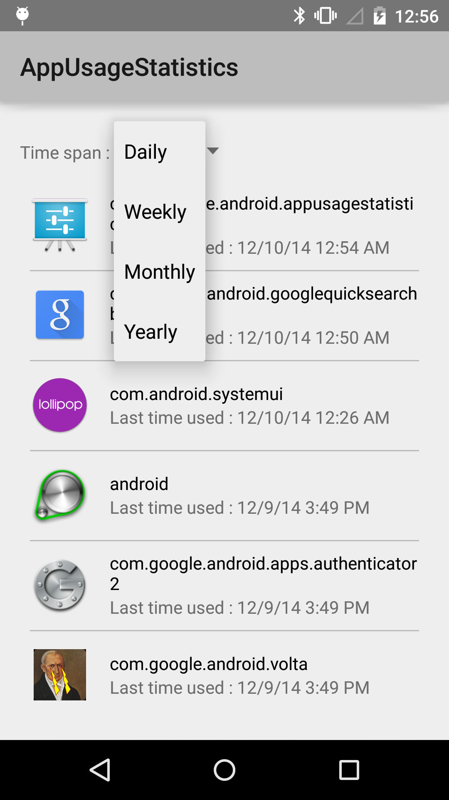
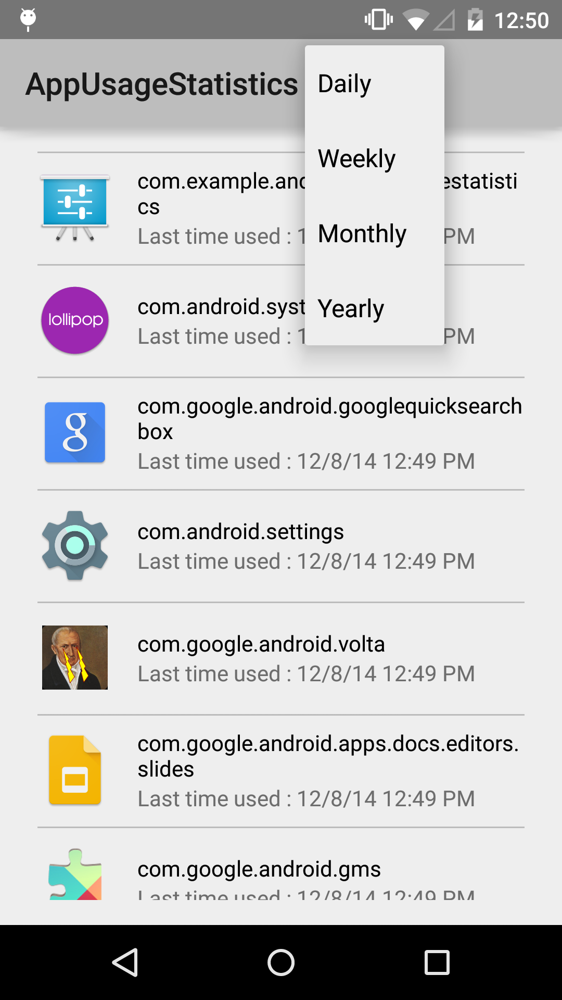
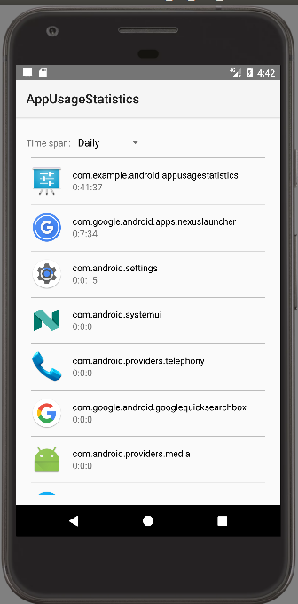
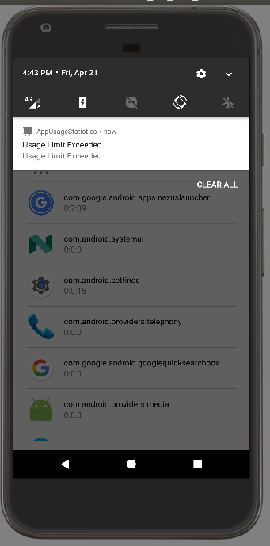
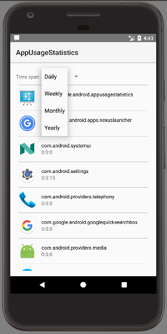
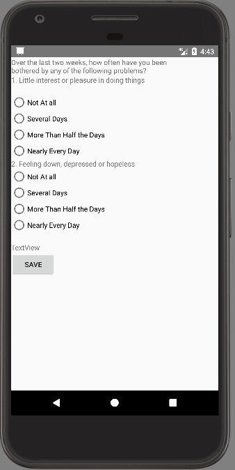

Android Telepsychiatry toolkit
===================================

A basic app showing that will help to determine if a user is stressed and/or depressed based on his phone usage pattern

Introduction
------------

The Project involves identification of exact approach to be used for capturing
data needed to detect signs of potential danger by developing the application
for capturing the identified factors with algorithm/s to identify patterns and take
appropriate actions. The app can be used as a self monitoring tool to monitor
ones usage pattern. Also, it serves as a tool for the psychiatrists to monitor their
patients between visits.
The [App usage statistics][1] API used allows app developers to collect statistics related to usage of
the applications. This API provides more detailed usage information than the deprecated
[getRecentTasks()][2] method.

This example illustrates how to use the App usage statistics API by showing the applications sorted
by the timestamp of the last time each app was used.

To use this API, you must first declare the `android.permission.PACKAGE_USAGE_STATS` permission
in your manifest. The user must also enable access for this app through
`Settings > Security > Apps with usage access`.

To collect the statistics of the app usage, you need to first get the instance of
[UsageStatsManager][3] by the following code:

```java
mUsageStatsManager = (UsageStatsManager) getActivity()
       .getSystemService(Context.USAGE_STATS_SERVICE);
```

Then you can retrieve the statistics of the app usage by the following method:

```java
Calendar cal = Calendar.getInstance();
cal.add(Calendar.YEAR, -1);
List<UsageStats> queryUsageStats = mUsageStatsManager
        .queryUsageStats(UsageStatsManager.INTERVAL_DAILY, cal.getTimeInMillis(),
                System.currentTimeMillis());
```

The first argument of the [queryUsageStats()][4] is used for the time interval by which the
stats are aggregated. The second and the third arguments are used for specifying the beginning
and the end of the range of the stats to include in the results.

[1]: https://developer.android.com/reference/android/app/usage/package-summary.html
[2]: https://developer.android.com/reference/android/app/ActivityManager.html#getRecentTasks(int%2C%20int)
[3]: https://developer.android.com/reference/android/app/usage/UsageStatsManager.html
[4]: https://developer.android.com/reference/android/app/usage/UsageStatsManager.html#queryUsageStats(int%2C%20long%2C%20long)

Pre-requisites
--------------

- Android SDK 25
- Android Build Tools v25.0.2
- Android Support Repository

Getting Started
---------------

This sample uses the Gradle build system. To build this project, use the
"gradlew build" command or use "Import Project" in Android Studio.
Screenshots
-------------

  


